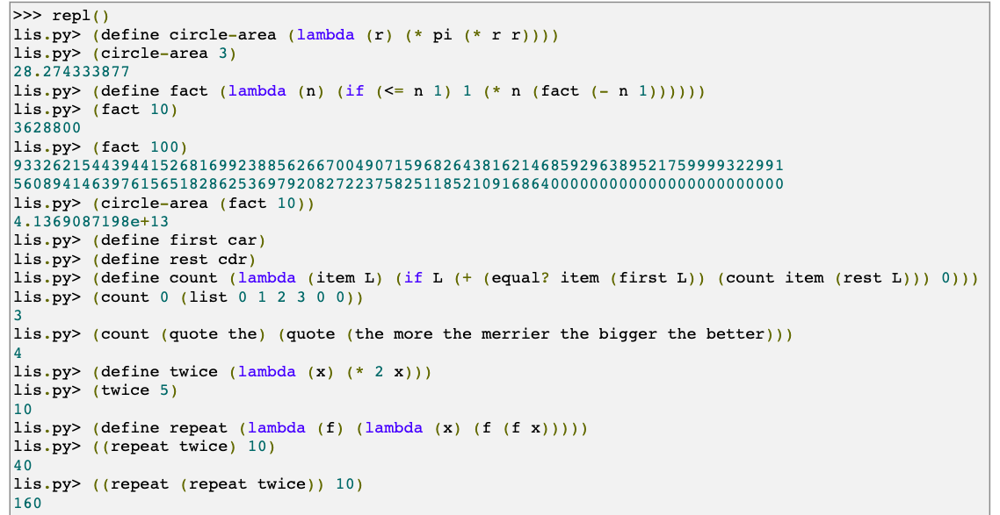

## A Lispy Interpreter Written by Python

This was the very first project I undertook, and I found it incredibly helpful in enhancing my 
understanding of programming languages and how computers process code.

<a href="https://norvig.com/lispy.html">Original link</a> by Peter Norvig.
